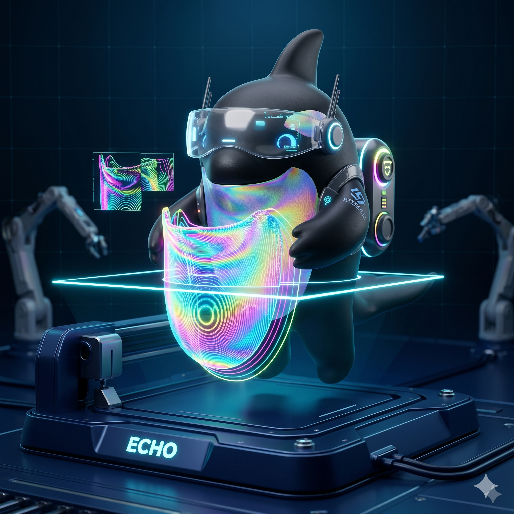

# OrcaXR



**OrcaXR** is the world's first XR-native 3D printing slicer, built primarily for **Android XR** (Samsung Galaxy XR and the Google Android XR platform) — and also runs on Android **phones and tablets** with an adaptive Material 3 shell so you can plate, paint, slice, and send to your printer from whatever device is in your hand.

Instead of a 2D port of a desktop application, OrcaXR provides a ground-up spatial experience. It combines the powerful **libslic3r** engine from [OrcaSlicer](https://github.com/SoftFever/OrcaSlicer) with a modern, immersive Jetpack Compose XR interface — and exposes every action over a local **Model Context Protocol (MCP) server** so an LLM can drive the slicer end-to-end with natural language.

On a phone or tablet (no XR session) the app falls back to a Compose Material 3 navigation shell with the same on-device libslic3r core, an interactive OpenGL ES 3 bed + model viewer (orbit, pinch zoom, drag-to-move), the same printer connectivity, and the same MCP server.

---

## ⚠️ DISCLAIMER: USE AT YOUR OWN RISK

**OrcaXR is experimental software.** 3D printing involves high temperatures, moving parts, and potential fire hazards.

*   **Software Status:** This project is in an early (Alpha) state. Slicing errors, unexpected G-code generation, or printer communication failures may occur.
*   **Liability:** The authors and contributors of OrcaXR are not responsible for any damage to your 3D printer, personal property, or physical injury resulting from the use of G-code generated by this software.
*   **Safety First:** Always verify the generated G-code in a desktop viewer before printing, and never leave your printer unattended while running a job sliced with OrcaXR.

---

## Highlights

### Spatial slicer
*   **1:1 build plate in your room** — plate, scale, rotate, and slice without leaving the headset; hand tracking and Galaxy XR controllers both supported.
*   **3D Transform Gizmo** — translate / rotate / scale via laser-drag, or numeric XYZ via the Transform panel.
*   **Multi-plate workspace** — virtual build plates as a workspace partition; per-plate slice + send.
*   **Multi-object 3MF support** — every object in a multi-part archive becomes its own selectable / transformable / paintable PlacedModel.
*   **Multi-selection & batch actions** — move / delete / re-plate several parts at once.
*   **Empty-state guidance + Recent files + Android share-target** — open `.stl` / `.3mf` / `.obj` from any app on the headset.

### Slicing engine
*   **Native arm64-v8a build of libslic3r v2.3.2** — same engine as desktop OrcaSlicer, 100% on-device.
*   **Multi-color & multi-tool** — full painted-3MF round-trip (color / support / seam / fuzzy-skin / brim-ears facet annotations preserved).
*   **Toolpath as triangulated tubes** — auto / per-extruder / per-feature color modes; layer scrubber suspended in 3D space.
*   **Adaptive (variable) layer height** — auto + manual editor.
*   **Custom G-code per print Z** — pause / color-change / template ticks (drop a magnet at Z=5 mm, etc.).
*   **Wipe-tower auto-positioning** — 8-candidate scoring places the prime tower clear of every part.
*   **G-code thumbnails** — Snapmaker / Elegoo touchscreen previews via a headless software rasterizer baked into the JNI shim.
*   **Calibration print library** — bundled Pressure Advance / Temperature / Flow / Retraction / VFA test meshes + a parametric variable-ramp generator.
*   **Foreground-service background slicing** — take off the headset mid-slice, come back, slice is done. Cancellable.

### Object editing
*   **Mesh repair, cut, boolean, split, simplify** — libslic3r-backed; the canonical "Fix Model" pipeline (ADMesh + CGAL self-union).
*   **Embossing & SVG inset** — text-on-object via stb_truetype + libslic3r `Emboss::polygons2model` + mcut boolean.
*   **Add primitives** — cube / cylinder / sphere / cone / disc / torus / slab as object or as part / negative / modifier / support enforcer / support blocker.
*   **Modifier volumes** — every libslic3r `ModelVolumeType`, including PARAMETER_MODIFIER + per-volume Object Settings.
*   **Bundled "handy model" library** — Benchy, Orca Cube, Voron Cube, Stanford Bunny, Cali Cat and more, in two taps.
*   **Bed-collision check** — full mesh-vs-bed; offending faces painted red in the preview GLB.

### Painting
*   **In-XR brush** — color / support / seam / fuzzy-skin / brim-ears with per-PlacedModel paint cache + multi-step undo/redo + smart-fill (BFS over shared-vertex adjacency, dihedral-bounded).
*   **AI semantic paint** — 33+ MCP tools driving the same paint surface from an LLM: spatial primitives (`paint_sphere`, `paint_slab`, `paint_normal_cone`, `paint_geodesic_disc`, `paint_with_mirror`, …), introspection (`get_model_geometry`, `get_curvature_segmentation`, …), vision (`render_view`, `render_views_grid`, `find_feature_anchors`, `get_mask_for_text`, `paint_decal`).
*   **Paint sessions** — `begin_paint_session` … `commit_paint_session` lets an LLM iterate dozens of refinements in scratch space, then commit as one undoable step.
*   **Bundled paint recipes** — `paint_template` resolves MakerWorld design IDs / SHA-256 / filename aliases against bundled recipes for known models.

### Connectivity & monitoring
*   **Klipper + Moonraker** — auto-discovery on the LAN, profile sync, G-code upload, live job monitoring.
*   **Spatial Digital Twin** — switch to Devices mode, the toolpath GLB grows in lockstep with the printer's reported Z-height.
*   **AFC slot sync + filament-runout badges** for the Snapmaker U1.

### LLM control surface
*   **Local MCP server** — bearer-token authed JSON-RPC over a hand-rolled HTTP/1.1 transport (no Ktor / Netty); foreground service so it survives Activity teardown.
*   **100+ tools** wired through `WorkspaceModel` / `WorkspaceAction` so an MCP-driven action and a hand-pinch are observably identical (same paint history, same caches, same observers).
*   **Voice → MCP** — Android `SpeechRecognizer` → regex-based `VoiceIntent` → `WorkspaceAction` for hands-free slicing, mode switching, and printer control.
*   **Image transport** — render artifacts streamed over `GET /resources/<token>.png` so a remote LLM with `WebFetch` can see the model.

### Phone & tablet shell
*   **Adaptive Material 3 navigation** — bottom nav on phones, navigation rail on tablets, nine destinations (Home / Slicer / Files / Monitor / Filament / Profiles / Settings / Paint / G-code preview).
*   **Interactive OpenGL ES 3 viewer** — bed sized from the active profile's `printable_area`, 10 mm minor + 50 mm major grid, single-finger orbit, pinch zoom, two-finger pan, and a "Move model" toggle that turns single-finger drag into translate-on-bed (drag deltas write straight back into the transform sliders so the two stay in sync).
*   **Camera presets** — Iso / Front / Right / Back / Left / Top / Reset chips that snap the GL camera to a known viewpoint.
*   **Same engine, same MCP, same printer flow** — every libslic3r call, every Moonraker upload, every MCP tool that runs on XR also runs on phone/tablet; the shell is the only thing that changes.
*   **Share-target import** — open `.stl` / `.3mf` / `.obj` from any app (browser, MakerWorld, Bambu Handy) and OrcaXR routes you straight to the Slicer screen with the file pre-loaded.

### Configuration & breadth
*   **Bundled profiles** — Snapmaker U1 (0.2 / 0.4 / 0.6 / 0.8 mm nozzles) + Elegoo Centauri Carbon (0.2 / 0.4 mm); branded filament leaves for PLA / PLA-CF / PLA Matte / PLA Eco / PLA Silk / PLA Metal / ABS / ASA / PETG / PETG-CF + generic PLA/ABS/PETG.
*   **Settings backup / restore** as JSON — survives device wipes, syncs across two headsets, exposed as MCP tools too.

## Prerequisites

*   **Hardware:**
    *   **Primary:** Samsung Galaxy XR headset or another Android XR compatible device.
    *   **Also supported:** Android phones and tablets — the same APK detects when no XR session is available and falls back to a Material 3 nav shell with an interactive OpenGL ES 3 bed + model viewer (orbit, pinch zoom, drag-to-move).
    *   `compileSdk 37, targetSdk 35, minSdk 31` (Android 12 and newer).
*   **Printer:** Klipper-based printers with Moonraker (e.g. Snapmaker U1, Elegoo Centauri Carbon). *Serial / USB / vendor-cloud connections are not supported and are out of scope.*

## Getting Started

### Installation

OrcaXR is currently in **closed alpha** on the Google Play Store. To get access:

1. Join the [Google Group](https://groups.google.com/g/orcaxr).
2. [Become a Play Store tester](https://play.google.com/apps/testing/dev.orcaxr.app/join).
3. Install from the Play Store, or sideload a release APK from the [GitHub Releases](https://github.com/ignacio82/OrcaXR/releases) page:
   ```bash
   adb install -r orcaxr-debug.apk
   ```

### Building from Source

OrcaXR requires the Android NDK to compile the native slicing engine. **NDK ≥ 26 / Clang ≥ 17** is mandatory (older toolchains miscompile libslic3r's paint segmentation — see [GEMINI.md](GEMINI.md) gotcha §29). The project pins NDK r29.0.14206865 and the build script asserts the floor.

1.  **Native core:**
    ```bash
    ./scripts/build_native.sh
    ```
    Initializes the OrcaSlicer submodule pinned to v2.3.2, applies the patch series under `patches/`, and cross-compiles `libslic3r_jni.so` for `arm64-v8a`.

2.  **Android app:**
    ```bash
    ./gradlew :app:assembleDebug
    ```
    Or open in Android Studio (Hedgehog or newer).

3.  **Tests:**
    ```bash
    ./gradlew :app:test                          # 100+ unit tests (host JVM)
    ./gradlew :app:connectedDebugAndroidTest     # instrumented (real device)
    ```

## Project Architecture

| Layer | Choice |
|---|---|
| UI | Jetpack Compose + `androidx.xr.compose:1.0.0-alpha12` |
| 3D | `androidx.xr.scenecore:1.0.0-alpha13` (`GltfModelEntity` for build plate, model preview, toolpath) |
| Session | `androidx.xr.runtime:1.0.0-alpha12` |
| Slicing core | OrcaSlicer `libslic3r` v2.3.2, cross-compiled for arm64-v8a, called over JNI |
| Network | OkHttp for Moonraker (Android's `HttpURLConnection` desyncs against Mainsail's nginx) |
| MCP | Hand-rolled HTTP/1.1 + JSON-RPC 2.0 on `ServerSocket`, bearer-token auth |
| Persistence | DataStore Preferences for profiles / printers / filaments / paint cache |
| Build | Single `:app` module today; module split deferred until boundaries hurt |

The full technical decision log (rendering gotchas, libslic3r gotchas, MCP wiring contract) lives in [GEMINI.md](GEMINI.md).

## Roadmap & known issues

The forward-looking feature roadmap is split between [ROADMAP.md](ROADMAP.md) (engine / XR UI / connectivity / architecture / profiles) and [ROADMAP-painting-and-editing.md](ROADMAP-painting-and-editing.md) (painting + object editing). Open audit follow-ups (security, robustness, code-health items) are tracked in section **H** of `ROADMAP.md`.

## Contributing

Contributions are what make the open-source community such an amazing place to learn, inspire, and create. Any contributions you make are **greatly appreciated**.

Please read [CONTRIBUTING.md](CONTRIBUTING.md) for the code of conduct and the pull-request process. All contributors must sign their commits to comply with our Developer Certificate of Origin (DCO).

## Acknowledgements

OrcaXR is a collaborative effort built upon the giant shoulders of the 3D printing community:

*   **[OrcaSlicer](https://github.com/SoftFever/OrcaSlicer)** — our core slicing engine. Special thanks to SoftFever and all contributors for the most feature-rich slicer in the industry.
*   **[PrusaSlicer](https://github.com/prusa3d/PrusaSlicer)** — the foundation upon which OrcaSlicer and Slic3r were built.
*   **[FullSpectrum](https://github.com/ratdoux/OrcaSlicer-FullSpectrum)** — for the innovative mixed-color filament implementation.
*   **[Snapmaker](https://github.com/Snapmaker/OrcaSlicer)** — for their open-source contributions to toolchanger support and U1 profiles.
*   **[Klipper](https://github.com/Klipper3d/klipper) & [Moonraker](https://github.com/Arksine/moonraker)** — for the firmware and API that make network-based slicing possible.
*   **Jetpack XR** — the Google / Samsung platform that makes spatial computing on Android a reality.

## Related work

Other Android-native slicer projects in the same space:

*   **[U1 Slicer for Android](https://github.com/taylormadearmy/u1-slicer-for-android)** — Snapmaker U1-only Android slicer built on the Snapmaker Orca 2.2.4 fork, with a Compose UI and an OpenGL ES bed/model viewer. OrcaXR's mobile-shell GL viewer (`app/src/main/java/dev/orcaxr/app/mobile/viewer/`) is ported from this project; see `NOTICE.md` for the per-file attribution. The slicing JNI architecture and 3MF pipeline are independent.

## License

OrcaXR is licensed under the **GNU Affero General Public License v3.0 (AGPL-3.0)**.

Because OrcaXR links against `libslic3r` (an AGPL project), this software is bound by the same requirements: any modifications or derivative works must also be open-sourced under the AGPL-3.0. See the `LICENSE` file for full details.

---
*Built with ❤️ for the future of spatial making.*
